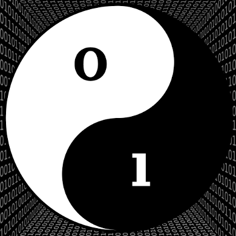

<h1 align="center">Introdução aos Princípios da Computação e Programação</h1>

<h1 align="center">
      
</h1>

Artigos que visam introduzir conceitos essenciais da Ciência da Computação e Programação.

## Conteúdo

- [Abstração](https://github.com/the-akira/IntroComp/blob/master/materiais/Abstra%C3%A7%C3%A3o/Artigo.md)
- [Algoritmos de Busca e Ordenação](https://github.com/the-akira/IntroComp/blob/master/materiais/Algoritmos%20de%20Busca%20e%20Ordena%C3%A7%C3%A3o/Artigo.md)
- [Controle de Fluxo e Iteração](https://github.com/the-akira/IntroComp/blob/master/materiais/Controle%20de%20Fluxo%20e%20Itera%C3%A7%C3%A3o/Controle%20de%20Fluxo%20e%20Itera%C3%A7%C3%A3o.md)
- [Dados e Armazenamento](https://github.com/the-akira/IntroComp/blob/master/materiais/Dados%20e%20Armazenamento/Artigo.md)
- [Debugging](https://github.com/the-akira/IntroComp/blob/master/materiais/Debugging/Debugging.md)
- [Eficiência e Ordem de Crescimento](https://github.com/the-akira/IntroComp/blob/master/materiais/Efici%C3%AAncia%20e%20Ordem%20de%20Crescimento/Artigo.md)
- [Estruturas de Dados](https://github.com/the-akira/IntroComp/blob/master/materiais/Estruturas%20de%20Dados/Artigo.md)
- [Hardware](https://github.com/the-akira/IntroComp/blob/master/materiais/Hardware/Artigo.md)
- [Linguagens de Programação](https://github.com/the-akira/IntroComp/blob/master/materiais/Linguagens%20de%20Programa%C3%A7%C3%A3o/Artigo.md)
- [Recursão e Programação Dinâmica](https://github.com/the-akira/IntroComp/blob/master/materiais/Recurs%C3%A3o/Artigo.md)
- [Simulações e Aleatoriedade](https://github.com/the-akira/IntroComp/blob/master/materiais/Simula%C3%A7%C3%B5es%20e%20Aleatoriedade/Artigo.md)
- [Software](https://github.com/the-akira/IntroComp/blob/master/materiais/Software/Artigo.md)
- [Referências](https://github.com/the-akira/IntroComp/blob/master/materiais/Refer%C3%AAncias.md)
